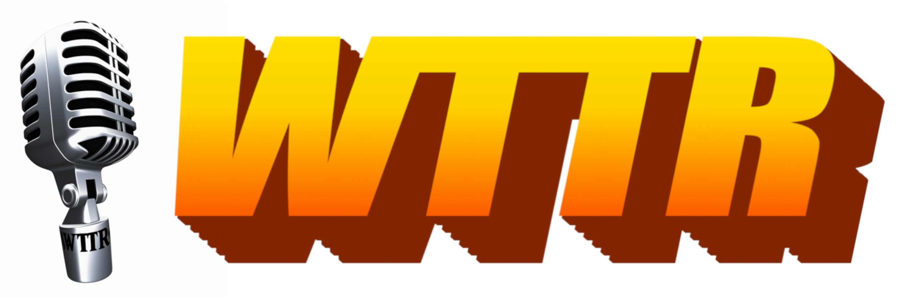

# Wet Toast Talk Radio


[](https://www.wettoast.ai/)
[](https://www.twitch.tv/wettoasttalkradio) [](https://ko-fi.com/wettoasttalkradio)

_Fake talk. Fake issues. Real giggles._

Generating content for Wet Toast Talk Radio, a 24/7 non-stop internet parody radio inspired by GTA. 

We don’t do reruns - all shows are generated daily. We use ChatGPT + a lot of prompt engineering and randomization for the writing of the scripts, and the amazing transformer + diffusion models of [tortoise-tts](https://github.com/neonbjb/tortoise-tts) for speech generation.

Checkout our [website](https://www.wettoast.ai/)!

# ToC

* [🚀 Getting Started](#-getting-started)
* [🍞 Usage](#-usage)
* [⚙️ Development](#-development)
* [😎 Credits](#-credits)
* [🤝 License](#-license)


## 🚀 Getting Started

### Prerequisites

- python >= 3.10
- [ffmpeg](https://github.com/jiaaro/pydub#getting-ffmpeg-set-up) `brew install ffmpeg`
- [libshout](https://icecast.org/download/) `brew install libshout`

### Install from Source

Install the package with pip:

```commandline
pip install -r requirements.txt
pip install -e .
```

or with your preferred virtual environment manager (_this project uses [pdm](https://pdm.fming.dev/) for dependency management_).

### CLI Configuration

Add your OpenAI API key in the following `config.yml` file in the project dir:

```yaml
scriptwriter:
  llm:
    openai_api_key: YOUR_OPENAI_API_KEY
audio_generator:
  use_s3_model_cache: false
```

## 🍞 Usage

⚠️ This CLI is designed as a demo of WTTR's generative capabilities. The full production services require to be deployed as part of the stack in the [aws](aws) directory.

### ✍️ Script Generation

To write a single script show:

```commandline
python -m wet_toast_talk_radio.main scriptwriter SHOW_NAME [--output-dir OUTPUT_DIR]
```

Currently available shows:

Show Name | Host | Description
---|---|---
`the-great-debate` | Julie | The show where you tune in to take sides
`modern-mindfulness` | Orion | Combining mindfulness and exposure therapy to let go of modern anxiety
`the-expert-zone` | Nick | The show where we ask the experts the difficult questions
`prolove` | Zara | The dating advice show where we love listening to you
`advert` | Ian | Advertisements from our beloved sponsors

For example, to generate an advertisement script in the folder `output`:

```commandline
python -m wet_toast_talk_radio.main scriptwriter advert --output-dir output
```

### 🗣 Audio Generation

⚠️ Audio generation is very slow with CPU. Generation with CPU is ~ 11x slower than real time, generation with Nvidia T4 16GB GPU is ~ 1.5x slower than real time. On first usage, models might also take a few minutes to download.

To generate audio for a given script:

```commandline
python -m wet_toast_talk_radio.main audio-generator generate [--script SCRIPT_PATH --output-dir OUTPUT_DIR]
```

For example, to generate audio for a script `the-great-debate-6c817b.jsonl` in the folder `output`:

```commandline
python -m wet_toast_talk_radio.main audio-generator generate --script output/the-great-debate-6c817b.jsonl --output-dir output
```

## ⚙️ Development

### Prerequisites

- python >= 3.10
- [pdm](https://pdm.fming.dev/latest/)
- [ffmpeg](https://github.com/jiaaro/pydub#getting-ffmpeg-set-up) `brew install ffmpeg`
- [libshout](https://icecast.org/download/) `brew install libshout`
- configure your [AWS credentials](https://docs.aws.amazon.com/cli/latest/userguide/cli-configure-files.html)

### Install

```commandline
pdm install --dev
```

### Configuration

This is used for local development, and assumes services mocked with localstack.

```yaml
message_queue:
  sqs:
    local: true
media_store:
  s3:
    local: true
    bucket_name: "media-store"
audio_generator:
  use_s3_model_cache: true
scriptwriter:
  llm:
    openai_api_key: sm:/wet-toast-talk-radio/scriptwriter/openai-api-key
disc_jockey:
  media_transcoder:
    clean_tmp_dir: false
  shout_client:
    password: "hackme"
```

### Dependency Management

Add new dependencies with pdm:

```commandline
pdm add torch
```

Then update `requirements.txt` and `dev-requirements.txt` by running:

```commandline
sh create-requirements.sh
```

### Testing

Unit tests are run with:

```commandline
pdm run pytest
```

The [test](./tests/) folder containes integration tests that need the `docker-compose up` cmd to run. These tests are skipped by default but can be enabled with the following flag: 

```bash
pdm run pytest --integration
```

### Localstack

We use [localstack](https://github.com/localstack/localstack) to mock AWS Services locally. These are configured in a docker-compose. To run:

```commandline
docker-compose up
```

#### S3

A localstack s3 bucket named `wet-toast-talk-radio` is located at [http://localhost:4566](http://localhost:4566).

You can access it from the cli like this:

```bash
aws --endpoint-url=http://localhost:4566 s3 cp ./wet_toast_talk_radio/media_store/virtual/data s3://wet-toast-talk-radio/raw --recursive
aws --endpoint-url=http://localhost:4566 s3 ls s3://media-store/raw/
aws --endpoint-url=http://localhost:4566 s3 ls s3://media-store/transcoded/
aws --endpoint-url=http://localhost:4566 s3 rm s3://media-store/transcoded/ --recursive
```

#### SQS

A localstack sqs MQ is located at [http://localhost:4566](http://localhost:4566).

You can access it from the cli like this:

```bash
aws --endpoint-url=http://localhost:4566 sqs list-queues
```

#### Icecast

A Icecast and Ices service will start on [http://localhost:8000/](http://localhost:8000/)

### CI

We use Github Actions to build our production docker images. Workflows are found under [.github/workflows](.github/workflows).

### Deployment

Wet Toast Talk Radio is deployed to AWS. See [./aws/README.md](./aws/README.md).

### Code Guidelines

We use [black](https://github.com/psf/black) as our code formattter.

We use [ruff](https://beta.ruff.rs/docs/) as our linter.

We use [pytest](https://docs.pytest.org/en/6.2.x/) as our testing framework.

Commits should follow the following convention:  `refactor|feat|fix|docs|breaking|misc|chore|test: description`

## 😎 Credits

Authors:

* [Camille Van Hoffelen](https://github.com/camille-vanhoffelen)
* [Raphael Van Hoffelen](https://github.com/dskart)

A special thanks to:

* Berenike Melchior, Unwavering Support
* Andy Moore, Comedy Consultant
* Gab, Nerd Advisor
* Gautier Roquancourt, Design Expert
* All the smart, beautiful people who gave feedback

Built with:

* Text-to-Speech from [tortoise-tts](https://github.com/neonbjb/tortoise-tts)
* 'Modern Mindfulness' background music from [RelaxingTime](https://pixabay.com/music/meditationspiritual-relaxing-music-vol1-124477/)
* GTA V video gameplay by [DopeGameplays](https://www.youtube.com/@DopeGameplays)
* Voice samples for conditioning latents from [CSTR VCTK Corpus](https://datashare.ed.ac.uk/handle/10283/3443)
* Splash sound sample from [Pixabay](https://pixabay.com/sound-effects/dive-6423/)
* CSS framework from [NES.css](https://nostalgic-css.github.io/NES.css/)
* Inspiration from Rockstar Games' brilliant radios


## 🤝 License

[MIT license](LICENSE)
